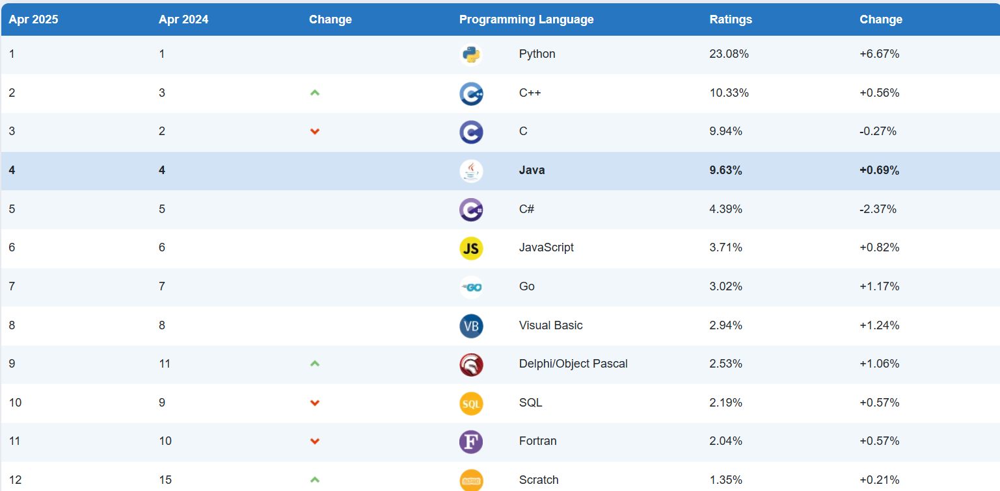
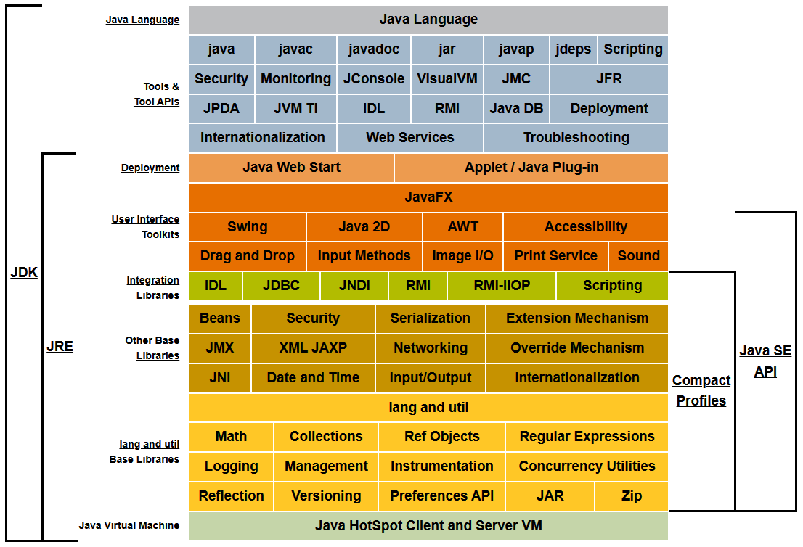

[[toc]]

# 起源
美国 · James Gosling，Java之父  
Java语言于1995.5.23 由SUN公司正式发布   
编程语言排行：[https://www.tiobe.com/tiobe-index/](https://www.tiobe.com/tiobe-index/)

          

# 新特性  

## Java 5 的新功能

- 枚举类型  
- 静态导入  
- 增强的for循环  
- 自动装箱/自动拆箱  
- 可变参数的方法  
- 泛型  
- 注解  

## Java 7 的新功能

- 二进制整数表示
- 在数值字面量中使用下划线
- 用String控制switch语句
- 菱形运算符
- 用一个catch捕获多个异常
- 使用try-with-resources实现自动资源管理
## Java 8 的新功能

- Lambda表达式
- 接口的默认方法和静态方法
- 新的日期/时间API
- 集合的聚集操作
- 类型注解

## Java 语言优点

- 语法简单
- 面向对象
- 平台独立性、可移植性
- 健壮性、安全性
- 分布式、高性能
- 多线程、动态性

# 应用领域

- 企业服务端软件开发，90%以上
- 科学计算
- 大数据、云计算
- 移动开发
- 桌面应用开发
- 游戏开发

# Java平台与开发环境

- Java标准版（Java Standard Edition，Java SE）
- Java企业版（Java Enterprise Edition，Java EE）
- Java微型版（Java Micro Edition，Java ME）

## JVM
Java Virtual Machine，Java虚拟机, 运行字节码。
## JRE
Java Runtime Enviroment，Java运行时环境, JVM和Java类库一起构成。
## JDK
Java Development Toolkit，Java开发工具包, 包括JRE，外加一个编译器和其他工具。
https://docs.oracle.com/javase/8/docs/



在 Java 中，源代码（sourcecode）被编译成字节码（bytecode），字节码需要在Java虚拟机（JVM）上运行。 

```java
class HelloWorld {
  public static void main(String[] args) {
    System.out.println("Hello World!");
  }
}
```